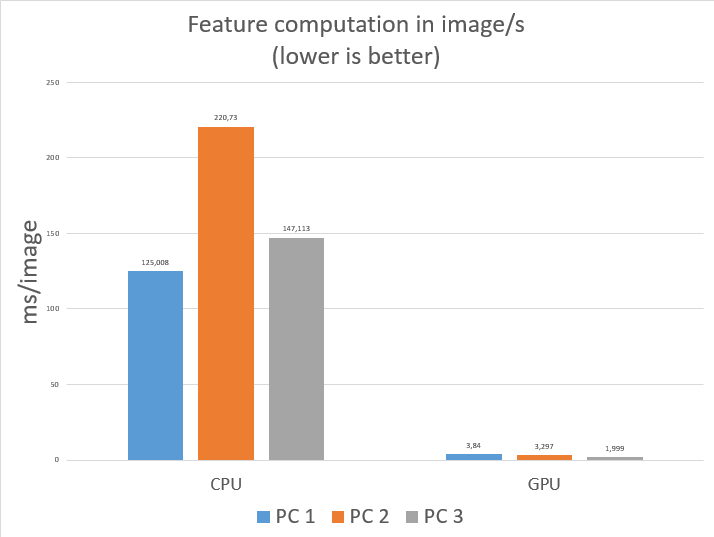
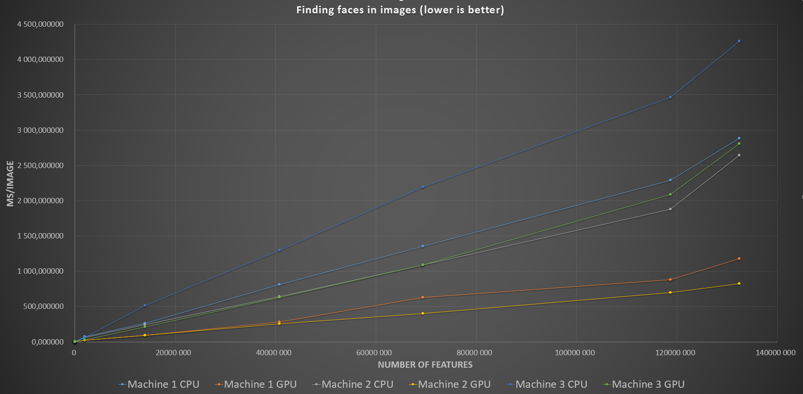

# Viola Jones implementation

Based on the following paper: http://www.ipol.im/pub/art/2014/104/article.pdf

[![Build Status][travis-image]][travis-url] [![License][license-image]][license-url]

### Specifications

Language: Java (JDK 8)

### Compatibility

Tested for:
* Windows 10 X64
* Ubuntu 16.04 X64

### Included dependencies

* [JCuda](http://www.jcuda.org/): Java bindings for CUDA (only used if available)
* [Jeigen](https://github.com/hughperkins/jeigen): Java wrapper for Eigen C++ fast matrix library

### Optional requirements

* [CUDA Toolkit 7.5](https://developer.nvidia.com/cuda-toolkit) 

## Installation

We provide .dll (for windows) and .so (for linux) JCUDA lib files in this repository.
In order to let the program access to these files, you must add their directory in your LD_LIBRARY_PATH environment variable.
For example, if you run linux:
```
export LD_LIBRARY_PATH=$LD_LIBRARY_PATH:/path/to/the/project/libs/JCuda-All-0.7.5b-bin-linux-x86_64/
```
For windows:
```
export LD_LIBRARY_PATH=$LD_LIBRARY_PATH:/path/to/the/project/libs/JCuda-All-0.7.5b-bin-windows-x86_64/
```

Also, don't forget to set JAVA_HOME & JRE_HOME environment variable respectively to the JDK & JRE folders.
For example:
```
export JAVA_HOME=/path/to/jdk1.8.0_102
export JRE_HOME=/path/to/jre1.8.0_101
```

If you use CUDA under windows, you will also need Visual Studio 2013 so that nvcc can compile CUDA cu files.


## Training and Test set

1. [CBCL FACE DATABASE](http://cbcl.mit.edu/cbcl/software-datasets/FaceData2.html)

## References

1. [An Analysis of the Viola-Jones Face Detection Algorithm](http://www.ipol.im/pub/art/2014/104/article.pdf)
2. [Robust Real-Time Face Detection](http://www.face-rec.org/algorithms/Boosting-Ensemble/16981346.pdf)
3. [Adam Harvey Explains Viola-Jones Face Detection](http://www.makematics.com/research/viola-jones/)
4. [5KK73 GPU Assignment 2012](https://sites.google.com/site/5kk73gpu2012/assignment/viola-jones-face-detection)
5. [Object detection using cascades of boosted classifiers](http://www.die.uchile.cl/ieee-cis/files/RuizdelSolar_T9.pdf)


# Statistics

## Machines

| ID |  CPU | RAM |  DISK | GPU | OS |
| --- | --- | --- | --- | --- | --- |
| 1 | i7-2600k @ 4,0Ghz OC | 2\*8Go + 2\*4Go (24Go) Corsair 1600Mhz | SSD - Samsung 840 Pro 256Go | GTX660 Ti (2Go) | W10 Pro X64 |
| 2 | i7-4790k @ 4,0Ghz | 2\*8Go (16Go) | SSD - Crucial BX100 500Go | GTX980 (4Go) | W7 Pro X64 |
| 3 | i5-2430M @2,4Ghz | 2\*4Go (8Go) | HDD - 750Go @ 7200rpm | GT555M (2Go) | Ubuntu 16.04 X64 |

## Computing features of images (set of 1000 images 19x19 - 1Ko/image)

| PC ID | CPU | GPU | Ratio CPU/GPU |
| --- | --- | --- | --- |
| 1 | 125.008 | 3.84 | 32 |
| 2 | 220.73 | 3.297 | 67 |
| 3 | 147.113 | 1.999 | 74 |

[](https://raw.githubusercontent.com/INVASIS/Viola-Jones/master/stats/stats2.png)


## Finding faces in images

### CPU


| Nb features | PC 1 (ms/img) | PC 2 (ms/img) | PC 3 (ms/img) | 
|-------------|----------|----------|----------| 
| 64          | 0,002287 | 0,000915 | 0,004284 | 
| 12 352      | 0,271627 | 0,251165 | 0,559474 | 
| 59 328      | 1,353477 | 1,21078  | 2,124605 | 
| 1 903 808   | 75       | 60       | 62       | 
| 13 996 096  | 265      | 244      | 513      | 
| 40 800 896  | 809      | 641      | 1 299,00 | 
| 69 309 952  | 1 353,00 | 1 089,00 | 2 194,00 | 
| 118 659 840 | 2 287,00 | 1 877,00 | 3 462,00 | 
| 132 435 136 | 2 881,00 | 2 646,00 | 4 263,00 | 

### GPU


| Nb features | PC 1 (ms/img) | PC 2 (ms/img) | PC 3 (ms/img) | 
|-------------|----------|----------|----------| 
| 64          | 0,904217 | 0,770088 | 0,502995 | 
| 12 352      | 1,632216 | 1,153261 | 0,78452  | 
| 59 328      | 1,806313 | 1,462818 | 1,27982  | 
| 1 903 808   | 20       | 20       | 28       | 
| 13 996 096  | 93       | 90       | 212      | 
| 40 800 896  | 284      | 258      | 629      | 
| 69 309 952  | 629      | 402      | 1 090,00 | 
| 118 659 840 | 884      | 696      | 2 089,00 | 
| 132 435 136 | 1 179,00 | 825      | 2 808,00 | 


[](https://raw.githubusercontent.com/INVASIS/Viola-Jones/master/stats/stats1.png)


[travis-url]: https://travis-ci.org/INVASIS/Viola-Jones
[travis-image]: http://img.shields.io/travis/INVASIS/Viola-Jones.svg?style=flat-square
[license-image]: http://img.shields.io/badge/license-MIT-green.svg?style=flat-square
[license-url]: LICENSE
